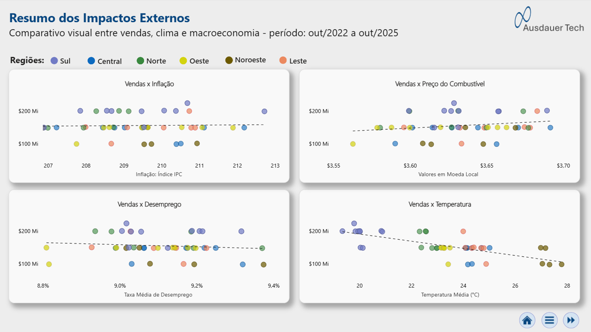
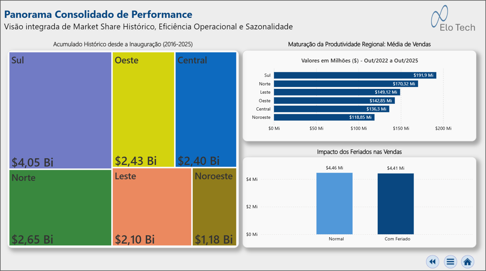

# 📊 Relatório Estratégico de Varejo: Case Walmart

## 🚀 Visão Geral
Este projeto simula um cenário complexo de expansão da rede de varejo Walmart em um país fictício ao longo de 9 anos (2016-2025) e como o **Relatório de Dados Estratégico** permitiu à diretoria analisar o impacto de inaugurações, a eficiência regional e as correlações com indicadores macroeconômicos. O relatório foi gerado após a remodelagem e a ampliação de um dataset simples, disponibilizado pelo [Kaggle](https://www.kaggle.com/datasets/mikhail1681/walmart-sales).

> 📂 **Nota:** Para fins de preservação e facilidade de acesso, uma cópia do arquivo original (`Walmart_sales_analysis.csv`) também está disponível na pasta **[Dataset](./Datasets)** deste repositório.
 

Um artigo descrevendo toda a saga que essa remodelagem acabou se transformando estará disponível, muito em breve. Assim que estiver pronto, substituirei esssa linha pelo link para acesso.
 

🔗 **[Clique Aqui para acessar o dashboard interativo](link_em_breve)**
 

**Importante:** Caso o link esteja indisponível, seja por ter expirado, seja por manutenção ou por qualquer outro motivo, ainda assim será possível acessar o relatório baixando o arquivo .pbix que está disponível na pasta Projetc deste repositório.

---

## 🛠️ Engenharia e Tecnologias
O projeto foi desenvolvido simulando um ciclo completo de BI:

* **Excel (Data Engineering):**
    * Modelagem de cenários estatísticos com aleatoriedade controlada para simular padrões de consumo realistas.
    * Tratamento de "Data Patching" para adequar os dados da fonte à realidade do cenário fictício.
* **Power Query (ETL Avançado):**
    * **Explosão de Granularidade:** Transformação de dados semanais em diários para análise temporal precisa.
    * **Limpeza Lógica:** Tratamento de datas anteriores à inauguração e propagação de atributos.
* **Power BI (DAX & Visualização):**
    * **Modelagem:** Star Schema com tabelas Fato e Dimensões.
    * **DAX Avançado:** Manipulação de contexto de filtro para métricas de eficiência e inteligência de tempo.
    * **UX/UI (Elo Tech Design):** Navegação entre as páginas como se o relatório fosse um aplicativo e utilização de Tooltips personalizadas.

---

## ⚠️ Nota de Execução
> **Atenção:** Como o Power BI utiliza caminhos absolutos para fontes de dados locais, ao baixar e abrir o arquivo .pbix na sua máquina, é necessário reconectar a fonte de dados:
> 1. No Power BI, vá em **Transformar Dados > Configurações da fonte de dados**.
> 2. Clique em **Alterar Fonte**.
> 3. Aponte para o arquivo `Walmart_Processed_Data.xlsx` que está dentro da pasta `Dataset` deste repositório.
> 4. Não esqueça, caso resolva optar por baixar os arquivos, de especificar em quais pastas eles serão armazenados. Recomendo que seja utilizada a mesma estrutura que você está encontrando aqui, porque se mudar a fonte de dados, isto é, o arquivo .xlsx, deverá realizar uma nova atualização, conforme mostrado no item 1.

---

## 💡 Algumas Imagens da Análise

### 1. Evolução Histórica
Monitoramento da trajetória de crescimento desde a inauguração da primeira loja, o período de adaptação de um ano após a inauguração da última loja e três anos de maturação com volume de produção ascendente.

### 2. Matriz de Correlações
Análise estatística visual utilizando a correlação das vendas com o índice de inflação, o preço do combustível, a taxa percentual de desemprego e a temperatura para identificar o comportamento das vendas e traçar os perfis das filiais.

### 3. Panorama Consolidado
Visão integrada da participação no mercado , do ranking de eficiência por filial e do impacto dos feriados na operação.

---
*Desenvolvido por **Elo Tech** | Dezembro 2025*
